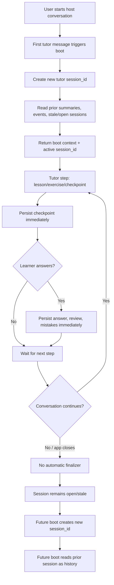
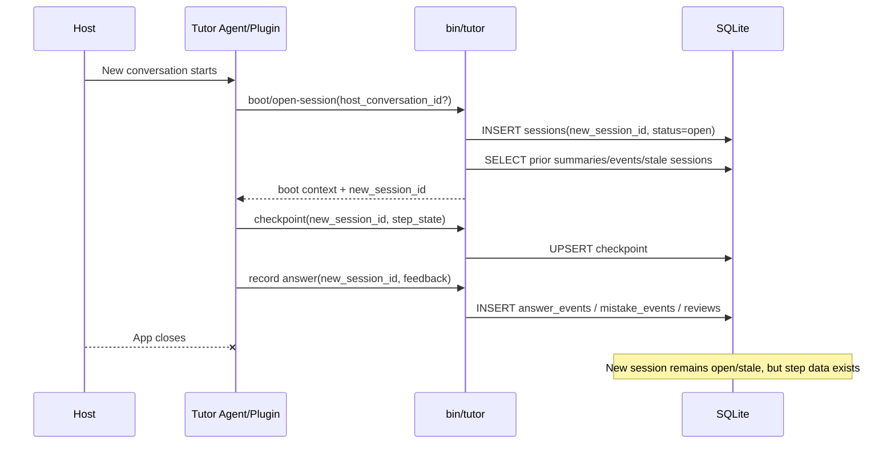

# Handoff: Drop Hooks, Use Incremental Lifecycle

**Date**: 2026-05-22
**Status**: Design handoff; not implemented
**Decision**: Drop hook-based lifecycle from tutor design. Tutor correctness must come from first-message boot plus incremental DB persistence.

## Context

We researched hook support for Codex, OpenClaw, and Hermes after the original
spec 006 adapter rollout. Current upstream docs show more hook capability than
the existing profiles captured, but hooks add host-specific complexity without
being necessary for correctness.

Why drop hooks entirely:

- Codex has `SessionStart`, but no true documented `SessionEnd`; `Stop` is turn-scoped.
- OpenClaw and Hermes have richer hook surfaces, but runtime install/validation is host-specific.
- Hooks can be disabled, unavailable, uninstalled, or behave differently across hosts.
- First-message boot plus per-step persistence gives stronger data safety than shutdown hooks.
- One lifecycle model is simpler: all hosts behave the same.

Therefore tutor lifecycle should not use hooks at all. Remove hooks from target
adapter contracts and package expectations instead of keeping them as optional
behavior.

## Core Decision

All hosts use same no-hook lifecycle:

1. First tutor message creates a new tutor session and renders boot context.
2. Every meaningful tutor step persists immediately.
3. Every learner answer persists immediately.
4. There is no automatic session end.
5. New host conversation gets a new `session_id`.
6. Next boot reads prior sessions as history but writes under the new `session_id`.
7. Old sessions without explicit close remain `open` or become `stale`.

## Lifecycle Table

| Capability | Target Behavior |
| --- | --- |
| Boot | First tutor message calls boot/create-session. |
| New session ID | From host conversation ID if available; else tutor generated. |
| Exercise/lesson start | Persist checkpoint immediately. |
| Answer/feedback | Persist answer event, review, mistakes immediately. |
| Mid-lesson app close | Data through last checkpoint survives. |
| Session end | Not automatic; session remains open/stale unless manually closed by explicit command. |
| Next boot | New `session_id`; reads completed/stale/open prior sessions as history. |

## Mermaid: New Lifecycle



## Mermaid: Session ID Ownership



## Data Ownership Model

`session-end` is not part of normal lifecycle. It is not source of truth.

Source-of-truth writes:

- Session create/open record on boot.
- Checkpoint on lesson/exercise/prompt presentation.
- Answer event on learner answer.
- Feedback/mistake events on evaluation.
- Vocabulary review state on vocab answer.
- Optional rolling session summary/checkpoint after each step.

Manual close writes, if user explicitly asks to close:

- Session closed marker.
- Final summary for future boot.
- Cost event flush.
- Final next-focus decision.

## Required New Concepts

### Session State

Need explicit session rows if not already present.

Suggested fields:

| Field | Purpose |
| --- | --- |
| `id` | Tutor session id. |
| `host` | `claude`, `codex`, `openclaw`, `hermes`, or unknown/manual. |
| `host_conversation_id` | Stable host conversation/thread id when available. |
| `status` | `open`, `closed`, `stale`, `abandoned`. |
| `started_at` | Session creation time. |
| `last_seen_at` | Updated by boot/checkpoint/record. |
| `closed_at` | Set only by explicit manual close. |

### Checkpoint

Need durable current-work state before answer exists.

Suggested fields:

| Field | Purpose |
| --- | --- |
| `id` | Checkpoint id. |
| `session_id` | Current tutor session id. |
| `modality` | `lesson`, `reading`, `transcript`, `vocab`, `writing`, `progress`. |
| `step_kind` | `started`, `prompt_shown`, `feedback_shown`, `progress_shown`, etc. |
| `prompt_ref` | Stable prompt/exercise id if available. |
| `state_json` | Safe step metadata only; no raw secrets or host logs. |
| `summary` | Short safe rolling summary for boot/resume. |
| `created_at` | Checkpoint time. |

### Boot Result

Boot should return active `session_id`, not just context.

Required output shape addition:

```json
{
  "session_id": "sess_...",
  "context": {
    "...": "existing boot context"
  }
}
```

If backward compatibility matters, keep existing `boot-context` and add a new
command:

```bash
rtk bin/tutor session-start --json '{"host":"codex","host_conversation_id":"..."}'
```

or:

```bash
rtk bin/tutor boot --json '{"host":"codex","host_conversation_id":"..."}'
```

## Updated Capability Semantics

Separate lifecycle from persistence.

Suggested profile fields:

| Field | Meaning |
| --- | --- |
| `lifecycle_start` | Always `first_message` for tutor-managed hosts. |
| `lifecycle_end` | Always `not_available` unless user runs explicit manual close. |
| `persistence_mode` | `incremental_checkpoint` for all hosts. |
| `session_id_source` | `host_conversation` if available, else `tutor_generated`. |
| `boot_context_trigger` | Always `first_tutor_message`. |

Target host declaration:

```json
{
  "lifecycle_start": "first_message",
  "lifecycle_end": "not_available",
  "persistence_mode": "incremental_checkpoint",
  "boot_context_trigger": "first_tutor_message"
}
```

Remove host-specific hook trigger values from target design. Do not model Codex
`Stop`, Claude `SessionEnd`, OpenClaw `session_end`, or Hermes `on_session_end`
as normal tutor lifecycle.

## Answer To Key Scenario

Scenario:

1. User starts Codex conversation.
2. Tutor starts lesson.
3. User closes Codex app before lesson ends.
4. No lifecycle hook runs, by design.

Expected behavior under new lifecycle:

- First tutor message created new `session_id`.
- Lesson start wrote checkpoint under that `session_id`.
- Any shown prompt/step wrote checkpoint under that `session_id`.
- Any submitted answer wrote answer/mistake/review events under that `session_id`.
- No `session-end` ran because normal lifecycle does not call it.
- Session remains `open`.
- Later boot creates a different new `session_id`.
- Later boot reads old open session as stale history/resume context.
- New data writes only to the new `session_id`.

## Current Repo State

Already close:

- `vocab answer` persists answer/review state.
- writing/reading/lesson/transcript record paths persist answer and mistake events.
- `session-end` only writes session summary/cost data and should be removed from
  normal automated lifecycle.

Gaps:

- Boot does not create or return a new session id.
- Prompt/lesson generation may not persist a checkpoint before answer.
- No explicit session table/status lifecycle.
- No stale/open-session detection in boot context.
- Some CLI write paths should be audited for missing `conn.commit()` around repository transactions.

## Implementation Plan Sketch

1. Add session/checkpoint models and migrations.
2. Add repository methods:
   - `open_session(host, host_conversation_id)`.
   - `touch_session(session_id)`.
   - `record_checkpoint(session_id, modality, step_kind, state, summary)`.
   - `close_session(session_id, analysis, costs)` for explicit manual close only.
   - `recent_open_or_stale_sessions(limit)`.
3. Add CLI command for boot/open session, or extend boot context with compatible output.
4. Update skills/plugin flows to call checkpoint whenever tutor presents a lesson/exercise.
5. Keep existing answer-event persistence.
6. Change host capability contracts to use `first_message` + `not_available` +
   `incremental_checkpoint` for all hosts.
7. Remove hook packaging from target adapters:
   - remove Claude hook requirement from future design
   - do not add Codex hooks
   - do not add OpenClaw hooks
   - do not add Hermes hooks
8. Keep `session-end` only as explicit manual/maintenance command, not adapter lifecycle.

## Remove Old Hook Implementation

Old hook-driven implementation must be removed or downgraded to legacy/manual
compatibility during migration. Do not leave old hooks as an alternate supported
adapter lifecycle.

Remove or rewrite:

| Area | Old Behavior | New Behavior |
| --- | --- | --- |
| `hooks/hooks.json` | Declares Claude `SessionStart` / `SessionEnd` lifecycle hooks. | Remove from required plugin surface or mark legacy-only. |
| `hooks/session-start.sh` | Auto-runs boot context from host lifecycle. | Replace with first-message boot command path. |
| `hooks/session-end.sh` | Auto-runs `session-end` on host shutdown. | Remove from normal lifecycle; keep only explicit manual close if needed. |
| Claude capability profile | `lifecycle_start=hook`, `lifecycle_end=hook`. | `lifecycle_start=first_message`, `lifecycle_end=not_available`. |
| Codex capability profile | `lifecycle_start=hook`, Codex plugin hook trigger. | `lifecycle_start=first_message`, `boot_context_trigger=first_tutor_message`. |
| OpenClaw capability profile | `first_message` boot, no checkpoint persistence. | `first_message` boot plus mandatory incremental checkpoint persistence. |
| Hermes capability profile | Explicit command boot. | `first_message` boot plus mandatory incremental checkpoint persistence. |
| `session-end` assumptions | Final lifecycle event creates useful next boot memory. | Per-step checkpoints/events create useful next boot memory; `session-end` is manual-only. |

Migration must also update docs/tests that currently assert hook lifecycle as the
normal behavior:

- `hooks/README.md`
- `README.md` host setup notes
- `docs/ROADMAP.md` Phase 6 lifecycle wording
- `specs/006-agent-adapter-setup/contracts/host-setup-profiles/*.md`
- `specs/006-agent-adapter-setup/manual-install-reports/*.md`
- `tests/adapter_contract/test_*adapter.py`
- `tests/adapter_contract/test_lifecycle_contract.py`
- `tests/packaging/test_plugin_surface.py`
- `tests/packaging/test_codex_plugin_package.py`
- `tests/packaging/test_openclaw_plugin_package.py`

Expected migration end state:

- No host setup profile claims hook lifecycle as target architecture.
- No host package requires hook installation for correctness.
- Hook files, if retained temporarily, are documented as deprecated legacy
  compatibility and excluded from capability/conformance assertions.
- Conformance tests verify first-message boot and checkpoint persistence for all
  hosts.
- Packaging privacy tests verify new checkpoint/session files do not package
  user-owned data.

## Migration Sequence

1. Freeze old hook behavior with current tests before editing, so breakage is visible.
2. Add new lifecycle schema fields: `persistence_mode`, `session_id_source`,
   first-message trigger semantics.
3. Add session/checkpoint persistence and migrations.
4. Add boot/open-session command that returns `session_id`.
5. Update all skills/adapters to call boot on first tutor interaction.
6. Add checkpoint writes to lesson/exercise presentation paths.
7. Change capabilities for Claude, Codex, OpenClaw, and Hermes to the new model.
8. Remove hook lifecycle assertions and package requirements.
9. Remove or deprecate old hook files.
10. Re-run adapter, packaging, integration, golden, pyright, and ruff gates.

## Non-Goals

- Do not use hooks for normal tutor lifecycle.
- Do not keep hooks as optional adapter behavior.
- Do not add host-specific hook packages for Codex, OpenClaw, or Hermes.
- Do not rely on Claude `SessionStart` / `SessionEnd` as target architecture.
- Do not mutate old session id when new conversation starts.
- Do not treat Codex `Stop` as true session end.
- Do not write host-specific state directly into tutor DB outside shared contracts.
- Do not store raw host logs, full conversation transcripts, secrets, or local config.

## Open Questions

- Should boot command remain `boot-context` or should a new `session-start` command own session creation?
- Should checkpoints store prompt text, prompt references only, or bounded safe summaries only?
- How should stale threshold be defined: time-based, host-based, or simply "open session not touched before new boot"?
- Should rolling summary be generated by agent after each step or deterministic local renderer from persisted events?
- Should every CLI record command require `session_id`, or allow default/generated id for backward compatibility?
- Should existing Claude hook files stay as legacy compatibility, or be removed in the same lifecycle migration?
